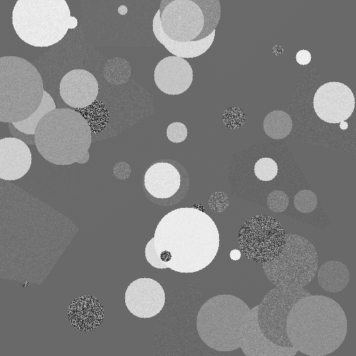
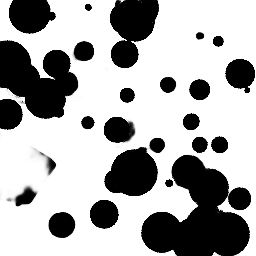

# Optimal Soft Tissue Differentiation for Planar kV X-ray Imaging Using Photon Counting Detectors, and a Convolutional Neural Network

A method for automated soft tissue differentiation is presented using planar kV imaging, a photon counting detector (PCD), and a convolutional neural network. Planar kV images were simulated with pencil-beam Monte Carlo and cone-beam analytical simulations. Simulations were preformed using 1 to 5 PCD energy bins with equal fluence and varying signal to noise ratios (SNR) between 10 to 250 measured in 4cm water. Algorithms using nonlinear as well as linear regression were used to predict the amount of cartilage for every pixel of the images. These algorithms were evaluated based on the error (MSE) between their prediction and the ground truth. The best algorithm was used to decompose randomly generated cartilage/soft tissue images with an SNR of 100. These images trained a U-Net convolutional neural network to segment the cartilage in the image. 

Code for the Monte Carlo simulation, matlab analysis, image generation, and unet CNN can be found here!


## Getting Started

First clone the repository into the directory of your choice, 

Using mac or linux and not windows, never windows:

```
git clone https://github.com/jerichooconnell/unet.git

```

### 1) UNet

#### Prerequisites

This tutorial depends on the following libraries:

* Tensorflow
* Keras >= 1.0

Also, this code should be compatible with Python versions 2.7-3.5.

#### Installing

The -gpu should change to -cpu if you are using a cpu
Assuming jupyter is already installed:


```
virtualenv tensorflow
source tensorflow/bin/activate
pip install tensorflow-gpu keras==2.1.6 scikit-image
```

If you are using a gpu you should also install cuda and cudNN

If you are using a cluster with slurm workload manager, and interactive nodes (bit of a long shot) your workflow could look like this:
These commands will set up a jupyter environment

```
module purge
module load python/3.5
virtualenv tensorflow2
source tensorflow2/bin/activate
module load cuda cudNN
pip install tensorflow-gpu keras==2.1.6 scikit-image
pip install jupyter
echo -e '#!/bin/bash\nunset XDG_RUNTIME_DIR\njupyter notebook --ip $(hostname -f) --no-browser' > $VIRTUAL_ENV/bin/notebook.sh
```

This command will start a server on an interactive node, you would need your own account though

```
salloc --time=1:0:0 --ntasks=1 --cpus-per-task=6 --gres=gpu:1 --mem=32000M --account=def-bazalova srun $VIRTUAL_ENV/bin/notebook.sh'''
```

A message with information about where the server is running will appear with a node number to put in <###>
Then on a local terminal create a tunnel to 

```
ssh -f jerichoo@cedar.computecanada.ca -L 8890:cdr<###>.int.cedar.computecanada.ca:8888 -N
```

The jupyter server should be forwarded to your browser at

```
https://localhost/8888
```


### 2) MC_simulation

#### Prerequisite

Install TOPAS which may or may not be free

* [TOPAS](http://topas.readthedocs.io) - MC simulation framework

#### Running

Excecute the REDLEN_many_runs.sh script from one of the run directories

### 3) Matlab Analysis

#### Prerequisite

Install matlab which is definetly not be free

* [Matlab](https://www.mathworks.com/products/matlab.html)

#### Running

There are two directories MC_3.0 which contains the analytical analysis which allows arbitrary SNRs but is limited in energy bins and DES_MC which is the monte carlo code which allows arbitrary binning but is limited in SNR

Both methods have a `Main` which calls the functions. There are three binary variables which control whether or not the linear method is used and/or the nonlinear method is used. Initialize loads new data but expects a certain directory structure.

### 4) Image Generation

#### Prerequisite

Again install matlab which is definetly not be free

* [Matlab](https://www.mathworks.com/products/matlab.html)

Further, install the matlab API for python, sorry that I use this but I really wanted a matlab function.

* [Matlab Engine API for python](https://www.mathworks.com/help/matlab/matlab_external/install-the-matlab-engine-for-python.html)

#### Running

The notebook image_generation.ipynb will take you through the image generation process.


# Implementation of deep learning framework -- Unet, using Keras

The architecture was inspired by [U-Net: Convolutional Networks for Biomedical Image Segmentation](http://lmb.informatik.uni-freiburg.de/people/ronneber/u-net/).

This implimentation is a combination of zhixuhao's unet implimentation with a generator borrowed heavily from jakeret's tf\_unet implementation. 

---

## Overview

### Data

The data is randomly generated CT images using a 4 energy PCD 


### Data augmentation

The data for training contains 30 512*512 images, which are far not enough to feed a deep learning neural network. I use a module called ImageDataGenerator in keras.preprocessing.image to do data augmentation.

See dataPrepare.ipynb and data.py for detail.


### Model


This deep neural network is implemented with Keras functional API, which makes it extremely easy to experiment with different interesting architectures.

Output from the network is a 512*512 which represents mask that should be learned. Sigmoid activation function
makes sure that mask pixels are in \[0, 1\] range.

### Training

The model is trained for 5 epochs.

After 5 epochs, calculated accuracy is about 0.99.

Loss function for the training is basically just a binary crossentropy.


### Results

Use the trained model to do segmentation on test images, the result is statisfactory.






## About Keras

Keras is a minimalist, highly modular neural networks library, written in Python and capable of running on top of either TensorFlow or Theano. It was developed with a focus on enabling fast experimentation. Being able to go from idea to result with the least possible delay is key to doing good research.

Use Keras if you need a deep learning library that:

allows for easy and fast prototyping (through total modularity, minimalism, and extensibility).
supports both convolutional networks and recurrent networks, as well as combinations of the two.
supports arbitrary connectivity schemes (including multi-input and multi-output training).
runs seamlessly on CPU and GPU.
Read the documentation [Keras.io](http://keras.io/)

Keras is compatible with: Python 2.7-3.5.
